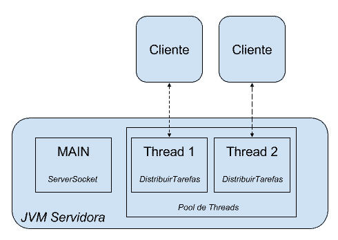

# Projeto servidor de tarefas...

***Objetivo do projeto:*** A ideia do nosso projeto é que o cliente envie comandos para o servidor,
e baseado neles é executada uma tarefa.

Para o transporte de dados e informações entre cliente e servidor, usaremos a classe Socket do java.

### Reaproveitando Threads

A partir da versão 5 do Java, o reaproveitamento de threads é nativo da plataforma Java através de um pool
de threads.

Para usar um pool de threads, devemos utilizar a classe Executors. Ela possui vários métodos estatísticos
para criar o pool específico. No exemplo, através do método newFixedThreadPool criaremos um pool com uma 
quantidade de threads pré-definidas:

```java
ExecutorService poolDeThreads = Executors.newFixedThreadPool(5);
poolDeThreads.execute(suaThread);
```

Quando não sabemos exatamente qual é o número ideal para o nosso pool, pode fazer sentido usar um pool que cresce 
dinamicamente. Novamente já há uma implementação pronta:

```java
ExecutorService poolDeThreads = Executors.newCachedThreadPool();
poolDeThreads.execute(suaThread);
```



### Compartilhando atributos entre Threads (Volatile).


Quando temos o acesso a uma variavel que pode ser acessada por diversas Threads ao mesmo tempo,
podemos ter vários problemas.

imagine o seguinte cenario:

O nosso cliente envia o comando shutdown, que é recebido através de uma thread dedicada e 
chama o método stop() que por sua vez manipula o atributo isRunning.

No cenário acima, pode ser que um cliente envie o comando shutdown e o servidor não seja 
desligado porque a thread pode cachear variáveis e é muito provável que isso acontecerá!
Cada thread é mapeada para uma thread nativa do sistema operacional, e esses caches 
nativos vão aproveitar o cache da CPU. Enquanto o nosso atributo fica na memória
principal, a thread o guarda no cache da CPU!

Exemplo do problema: 


Quando não queremos usar o cache das threads, usamos o ***volatile***.

O nosso atributo será ***volatile***, que significa que cada thread deve acessar 
diretamente a memória principal.


```java
private volatile boolean estaRodando = false;
```


Resumindo, quando declaramos uma variável como volatile, definimos:

- Que o valor dessa variável nunca será cacheado pela thread, todo o acesso vai diretamente na memória dessa variável.
- O acesso funciona de maneira atômica, como se fosse sincronizado.

### Usando variáveis atômicas...

Há uma alternativa ao uso da palavra chave volatile. Em vez de usar volatile diretamente, podemos utilizar classes do pacote 
java.util.concurrent.atomic. Nesse pacote encontraremos uma classe com o nome AtomicBoolean que garante que todas as threads 
usam essa variável de maneira atômica, sem cache.

```java
private AtomicBoolean estaRodando;
```

### Tratamento de erros com Threads...

Cada thread possui a sua própria pilha de execução.

Quando inicializamos o nosso programa, a JVM cria automaticamente a 
thread MAIN e ela sempre começa no método main (que surpresa). 
O main é o primeiro método na pilha de métodos! Se chamamos um novo
método a partir do main, este fica no topo dessa pilha e assim por diante:
 
 


Como inicializamos uma nova thread, essa também terá a sua pilha, 
independente da thread MAIN. A diferença é que essa pilha começa com 
o método run, da classe Thread, que por sua vez chama o método
run da tarefa (Runnable) :


Essa pilha também é visível na saída do console que recebemos antes,
pois mostra o caminho que a exceção traçou. Quando ocorre uma exceção
no nosso código, ele se comporta como um bomba que cai em cima da pilha. 


Se não há nenhum bloco try-catch, essa bomba vai remover o método da pilha:


E se não existe mais nenhum método na pilha, o rastro da exceção aparece no console:


Repare que a exceção anda totalmente independente da outra pilha.
Mesmo com a exceção na Thread 1, a thread MAIN continua rodando.
Também não adianta tentar pegar a exceção através de um try-catch!

***Capturando exceções***

Para capturar uma exceção lançada por uma thread, usamos a classe ***UncaughtExceptionHandler***


```java
 Thread thread = new Thread(new Runnable() {

    public void run() {
            // código que gera uma exceção omitido
        }
    });

    // passando o objeto com a responsabilidade de tratamento de erro
    thread.setUncaughtExceptionHandler(new TratadorDeExcecao());

    thread.start();

```
### Retornos no futuro

A Interface Callable é uma alternativa a interface Runnable.

As interfaces Runnable e Callable servem para definir uma tarefa de uma thread.

A diferença do Callable é que pode retornar algo e jogar qualquer exceção.

Para usar um Callable com threads sempre precisamos de um pool de threads (ExecutorService).

O método submit(..) do pool recebe um Callable retorna um Future

O Future representa o resultado da execução que talvez não tenha terminado ainda

OBS: Dada uma Future, nós obtemos seu resultado através de uma chamada ao método
get, este sim, bloqueia a execução do nosso código até que o seja retornando 
o resultado da operação assíncrona.


***FutreTask***


Temos duas interfaces para definir a tarefa de uma thread: a antiga Runnable e a mais recente Callable.

A diferença é que Callable possui um retorno e trabalha com exceções do tipo checked. Além disso, um Callable só pode ser executado através de um pool de threads.

Como já falamos não se pode usar uma thread com um Callable! Veja o código abaixo que não compila pois o construtor da classe Thread só funciona com Runnable:

```java
Callable<String> tarefa = new Tarefa(); //Tarefa implementa Callable
new Thread(tarefa).start(); //não compila!!
```
Isso significa que somos obrigados de usar um pool com Callable? E se no meu código não há a possibilidade de usar um pool de threads?

Felizmente há uma solução para resolver esse impasse que se chama de FutureTask!

Veja o código:

```java
Callable<String> tarefa = new Tarefa(); //Tarefa implementa Callable
FutureTask<String> futureTask = new FutureTask<String>(tarefa);
new Thread(futureTask).start(); //usando Thread puro!!            
String resultado = futureTask.get();
```
Isso funciona pois o FutureTask também é um Runnable (implementa a interface Runnable)! Repare também que o FutureTask recebe no construtor o Callable (a tarefa).

Podemos concluir que o FutureTask é um intermediário entre Callable e Runnable.

### Fila thread-safe: BlockingQueue


Diferentemente de uma Queue comum, Há métodos que simplesmente travam a
thread para disponibilizar um elemento ou tirar um elemento na fila. 
Isto é importante, pois queremos criar produtores e consumidores para a mesma fila,
tudo assincronamente em threads separadas. Por exemplo, para consumir um 
elemento da fila, podemos trocar o método poll() por take(). O take()
espera até o próximo elemento ficar disponível na fila e assim trava a thread. 

```java

public class TesteFila {

    public static void main(String[] args) throws InterruptedException {

        BlockingQueue<String> fila = new ArrayBlockingQueue<>(3);
        fila.offer("c1");
        fila.offer("c2");
        fila.offer("c3");        

        System.out.println(fila.take());
        System.out.println(fila.take());
        System.out.println(fila.take());
        System.out.println(fila.take());//trava o main aqui

        System.out.println(fila.size());
    }
}

```

Além disso, temos o método o put para adicionar um elemento na fila, 
mas respeitando a capacidade da fila. Em outras palavras, se a fila 
estiver cheia o put esperará até que haja capacidade. Isso é importante,
pois a nossa implementação ArrayBlockingQueue tem um limite definido. 
Veja o código abaixo:

```java

public class TesteFila {

    public static void main(String[] args) throws InterruptedException {

        BlockingQueue<String> fila = new ArrayBlockingQueue<>(3); //max 3 elementos
        fila.put("c1");
        fila.put("c2");
        fila.put("c3");
        fila.put("c4"); //trava o MAIN

        System.out.println(fila.take());
        System.out.println(fila.take());
        System.out.println(fila.take());

        System.out.println(fila.size());
    }
}

```

Como a nossa fila aceita apenas 3 elementos, ao tentar adicionar o quarto elemento, a thread MAIN trava também.

 