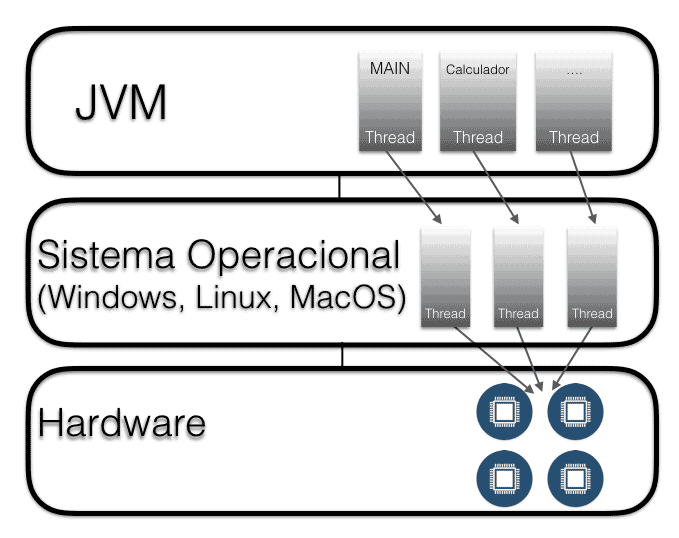

### Threads

A classe Thread

Criar um Thread é fácil, basta instanciar um objeto da classe Thread:

```java
Thread threadMultiplicador = new Thread();
```
Mas de alguma forma é preciso dizer o que o Thread deveria fazer, no nosso caso é a multiplicação, certo? Nós precisamos passar a multiplicação para o Thread! Olhando no construtor do Thread, podemos ver que a classe recebe algo que se chama o Runnable. Ele recebe algo que é rodável!

### A interface Runnable

Essa Runnable é uma interface que possui apenas um método run. Nesse método vamos definir o que queremos executar nesse Thread que é justamente o cálculo de multiplicação. Então mãos à obra, 
vamos criar uma nova classe que implementa essa interface:

```java

package br.com.alura.threads;

public class TarefaMultiplicacao implements Runnable {

    @Override
    public void run() {
        //esse método o nosso thread executará
    }

}

```

### Mapeamento dos Threads para SO

Reparem que não foi necessário utilizar alguma biblioteca extra para trabalhar 
com threads. Quando o Java foi lançado, isso foi um grande diferencial pois 
a JVM já veio com suporte nativo para trabalhar com threads. Além disso, 
a máquina virtual mapeia os threads dela para threads ou processos do sistema
operacional. Ou seja, se seu sistema operacional dá suporte à execução
em paralelo, muito provável que podemos realmente executar código em paralelo.
Claro que isso também depende da implementação da JVM em si, mas hoje em dia,
pode ter certeza, se você usa a máquina virtual da Oracle ou da IBM, que essas
máquinas virtuais mapeiam os threads para o sistema operacional. Ou seja, com
Java em mãos, nada impede de realmente aproveitar a execução em paralelo.



### Sincronizando a execução de Threads

Para evitar que diversas Threads acessem comportamentos ao mesmo tempo,
podemos ***sincronizar*** a execução do código.

Como na vida real, é preciso definir que só podemos acessar o banheiro quando 
temos a chave em mãos. É preciso trancar a porta! A notícia boa é que qualquer
objeto possui uma chave e podemos pedir para o convidado/thread pegar essa chave. Sem a chave não será possível acessar e executar esse bloco de código!

No mundo Java, você pega a chave através da palavra chave synchronized.
Podemos sincronizar o acesso ao objeto, o nosso banheiro! Veja como fica
o código do método fazNumero1(): 

```java

public void fazNumero1() {

    String nome = Thread.currentThread().getName();

    System.out.println(nome + " batendo na porta");

    synchronized (this) {

        System.out.println(nome + " entrando no banheiro");
        System.out.println(nome + " fazendo coisa rapida");

        try {
            Thread.sleep(8000);
        } catch (InterruptedException e) {
            e.printStackTrace();
        }

        System.out.println(nome + " dando descarga");
        System.out.println(nome + " lavando a mao");
        System.out.println(nome + " saindo do banheiro");
    }
}

```

Tudo que está dentro do bloco syncronized só poderá ser executado através
de um único thread. O synchronized(this) significa: "convidado, tente pegar
a chave do banheiro"! Sem a chave, o thread fica bloqueado, esperando
a liberação.

Ou seja, só um convidado pode entrar no banheiro ao mesmo tempo. Até
vários podem bater na porta ao mesmo tempo, mas realmente "fazer o negócio",
apenas um. 

### Entendendo o synchronized

Não temos controle sobre qual thread realmente começa a execução.
Pode ser uma ou outra, mas repare que ambos "batem na porta".
No caso do banheiro, o João foi o primeiro (poderia ter sido outro). Ele conseguiu então entrar no banheiro
primeiro e a partir desse momento todos os comandos dentro do bloco
synchronized serão executados de uma vez só. Até pode ser que o Pedro bata
na porta nesse mesmo tempo (repare que a impressão do "batendo na porta"
está fora do bloco syncronized), mas nenhum outro thread pode obter a
chave desse objeto para executar o código sincronizado!

Em outras palavras, os comandos dentro do bloco serão executados de
maneira atômica. Quando o João sai do banheiro, ou seja, sai do bloco
synchronized, ele devolve a chave. Nesse momento o Pedro, que ficou
bloqueado, pode entrar no banheiro e fazer as coisas que ele precisa fazer.

A chave que usamos para sincronizar o acesso também é chamado de Mutex.
O Mutex é utilizado para executar algum bloco de código de maneira atômica.

### Coleções thread safe

Como podemos trabalhar de maneira thread safe com listas? Há duas formas
de resolver o problema. A primeira é utilizar um método auxiliar da classe
java.util.Collections:

```java
List<String> lista = Collections.synchronizedList(new ArrayList<String>());
```

A segunda forma é utilizar uma coleção que já foi implementada de maneira thread safe. 
A classe Arraylist possui um "irmão", que se dá muito bem com vários threads.
Esse "irmão" se chama de Vector. Então podemos testar e criar uma instância
da classe Vector :

```java
List<String> lista = new Vector<String>();
```

### Colocando uma Thread em estado de espera (Waiting) e notificando-a (Notify all).

Quando um thread executa o método wait(), ele sabe que tem que devolver a chave e esperar. O thread fica no estado de espera. 
Pense que existe um banco na frente do banheiro, onde os convidados ficam esperando até alguém limpar o banheiro!

exemplo:

```java
private void esperaLaFora(String nome) {

    System.out.println(nome + ", eca, banheiro está sujo");
    try {
        this.wait();
    } catch (InterruptedException e) {
        e.printStackTrace();
    }
}

```

Acordar os threads que estão no estado waiting chama-se notificar. Essa notificação deve ser feita através de um novo thread que executará a tarefa de limpeza. Após ter terminado a limpeza,
é preciso avisar os convidados!

```java
public void limpa() {
    this.ehSujo = false;
    this.notifyAll(); // método que notifica as threads que estão no estado de espera...
}

```

### Entrendendo o Deadlock]

Um deadlock ocorre quando uma thread impede a execução de outra pois cada 
um possui a chave de um objeto que o outro precisa para continuar. 
Temos um impasse e esse impasse é chamado de deadlock.

***Abaixo segue um pequeno exemplo de deadlock:*** 

```java

public class TarefaAcessaBanco implements Runnable {
    private PoolDeConexao pool;
    private GerenciadorDeTransacao tx;

    public TarefaAcessaBanco(PoolDeConexao pool, GerenciadorDeTransacao tx) {
        this.pool = pool;
        this.tx = tx;
    }

    @Override
    public void run(){
        synchronized (pool) {

            System.out.println("Peguei a chave do pool");
            pool.getConnection();

            synchronized (tx) {

                System.out.println("Peguei a chave da tx");
                tx.begin();

            }
        }
    }
}

```

```java
public class TarefaAcessaBancoProcedimento implements Runnable {
    private PoolDeConexao pool;
    private GerenciadorDeTransacao tx;

    public TarefaAcessaBancoProcedimento(PoolDeConexao pool,
                                         GerenciadorDeTransacao tx) {
        this.pool = pool;
        this.tx = tx;
    }

    @Override
    public void run() {
        // dentro do método run da classe TarefaAcessaBancoProcedimento
        synchronized (tx) {

            System.out.println("Peguei a chave da tx");
            tx.begin();

            synchronized (pool) {

                System.out.println("Peguei a chave do pool");
                pool.getConnection();
            }
        }
    }
}


```

```java
public class PrincipalBanco {

    public static void main(String[] args) {
        GerenciadorDeTransacao tx = new GerenciadorDeTransacao();
        PoolDeConexao pool = new PoolDeConexao();

        /*
        * o deadlock ocorre porque um thread impede a execução do outro pois cada um possui a chave de um objeto que
        * o outro precisa para continuar. Temos um impasse e esse impasse é chamado de deadlock.
        *
        * No exemplo abaixo, a classe TarefaAcessaBanco pega a chave (mutex) do pool primeiro e depois do tx
        * e na thread TarefaAcessaBancoProcedimento a ordem está invertida, primeiro é obtida a chave de tx e depois do pool
        * logo isso acaba gerando um conflito e a execução da aplicação (das threads na verdade) nuca é encerrada.
        *
        * Para resolver este problema basta apenas colocar o acesso aos objetos (pool e tx) na mesma ordem em ambas as threads.        *
        *
        * */
        new Thread(new TarefaAcessaBanco(pool, tx)).start();
        new Thread(new TarefaAcessaBancoProcedimento(pool, tx)).start();

    }
}
```